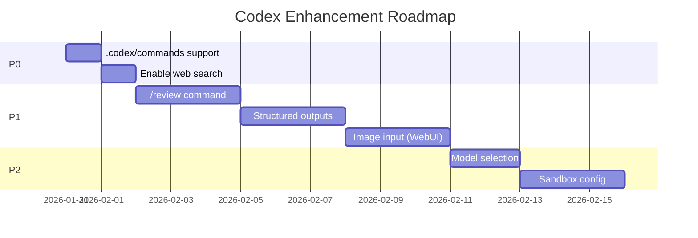

# Codex Integration Enhancement Backlog

> **Branch**: `feature/codex-integration-analysis`  
> **Created**: 2026-01-30  
> **Source**: [codex-integration-analysis.md](file:///C:/Users/kenny/.gemini/antigravity/brain/36c6fb01-ad6c-40b7-92a3-1d25582545b1/codex-integration-analysis.md)

## Priority Legend
- 🔴 **P0**: Critical - High value, low effort
- 🟠 **P1**: High - High value, medium effort  
- 🟡 **P2**: Medium - Medium value, medium effort
- 🟢 **P3**: Low - Nice-to-have

---

## 🔴 P0: Critical (Quick Wins)

### 1. Add `.codex/commands` Folder Support
**Value**: Parity with Claude  
**Effort**: 1 line change  
**File**: `src/handlers/command-handler.ts:275`

```typescript
// Current
for (const folder of ['.claude/commands', '.agents/commands']) {
// Proposed
for (const folder of ['.claude/commands', '.codex/commands', '.agents/commands']) {
```

---

### 2. Enable Web Search (`--search`)
**Value**: External knowledge for prompts  
**Effort**: Config update to `setup-auth.ts`

```toml
[features]
web_search = "live"
```

---

## 🟠 P1: High Priority

### 3. Implement `/review` Slash Command
**Value**: Built-in code review (vs base branch, uncommitted, commit)  
**Effort**: 1-2 days  
**Approach**: Spawn `codex review` CLI subprocess

```
/review              # Interactive picker
/review branch main  # Diff against main
/review uncommitted  # Staged + unstaged
/review commit abc   # Specific commit SHA
```

---

### 4. Structured Output for GitHub Issues
**Value**: Consistent issue triage, metadata extraction  
**Effort**: 2-3 days  
**Approach**: Use `codex exec --output-schema` for issue processing

```json
{
  "severity": "high",
  "component": "auth",
  "suggested_assignee": "backend-team",
  "estimated_effort": "2 days"
}
```

---

### 5. Image Input Support (WebUI)
**Value**: Screenshot debugging, design implementation  
**Effort**: 2-3 days  
**Components**:
- WebUI: File upload → base64/temp file
- Backend: Pass to Codex via `-i` flag (CLI) or thread options (SDK)

---

## 🟡 P2: Medium Priority

### 6. Model Selection via `/setmodel`
**Value**: Switch between gpt-5, gpt-5-codex, etc.  
**Effort**: 1 day  
**Changes**:
- Add `/setmodel <model>` command
- Store in conversation metadata
- Pass to Codex SDK/CLI

---

### 7. Per-Codebase Sandbox Configuration
**Value**: Security flexibility  
**Effort**: 2-3 days  
**Changes**:
- Add `sandbox_mode` column to `remote_agent_codebases`
- UI for selecting: `read-only`, `workspace-write`, `danger-full-access`
- Pass to Codex on thread creation

---

### 8. JSONL Output Mode for Automation
**Value**: Better event streaming for CI/CD  
**Effort**: 1-2 days  
**Approach**: For automated tasks, spawn `codex exec --json` instead of SDK

---

## 🟢 P3: Lower Priority (Future)

### 9. Codex Cloud Integration
**Value**: Offload heavy tasks, parallel attempts  
**Effort**: 1 week+  
**Requires**: Cloud environment setup, auth flow

### 10. App Server Protocol Migration
**Value**: Full JSON-RPC control  
**Effort**: 1-2 weeks (full CodexClient rewrite)  
**Trade-off**: More complex, but more powerful

### 11. MCP Server Mode
**Value**: Run Codex AS an MCP server  
**Effort**: 1 week  
**Use Case**: Multi-agent orchestration

### 12. Multi-Directory Mode (`--add-dir`)
**Value**: Work across multiple repos  
**Effort**: 1-2 days  
**Use Case**: Monorepo setups

---

## Implementation Order (Recommended)



---

## Notes

- All P0 and P1 items can be implemented **without breaking changes**
- P1-5 (Image input) requires WebUI changes
- P2-7 (Sandbox config) requires DB migration
- P3 items are exploratory and may not be needed
